# Architecture Documentation

## Table of Contents

- [System Overview](#system-overview)
- [High-Level Architecture](#high-level-architecture)
- [Component Architecture](#component-architecture)
- [Data Flow](#data-flow)
- [Database Schema](#database-schema)
- [Security Architecture](#security-architecture)
- [Integration Architecture](#integration-architecture)

---

## System Overview

Ayphen TalentX is a modern, multi-tenant SaaS application built with a microservices-ready monolithic architecture. It follows clean architecture principles with clear separation of concerns.

### Key Principles

- **Multi-tenancy**: Complete data isolation per tenant
- **Scalability**: Horizontally scalable stateless services
- **Security**: Defense in depth with multiple security layers
- **Extensibility**: Plugin-based integration system
- **Performance**: Caching, pagination, and query optimization

---

## High-Level Architecture

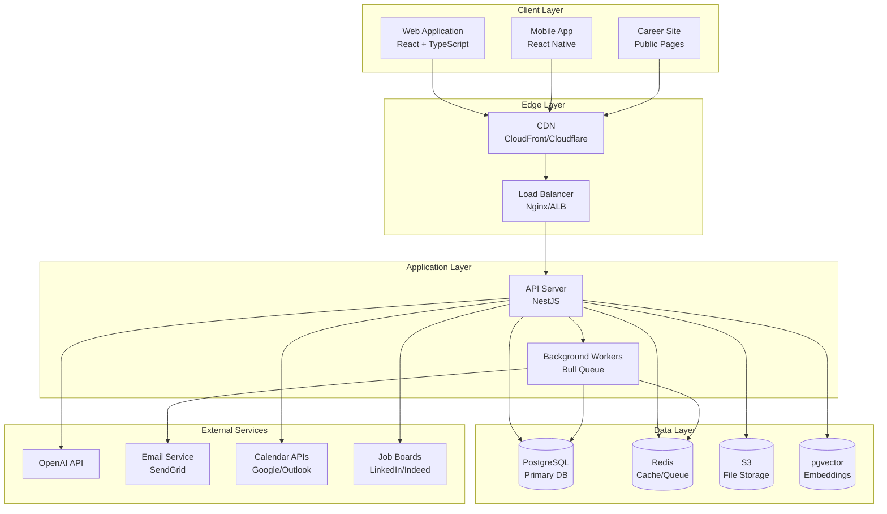

---

## Component Architecture

### Backend Module Structure

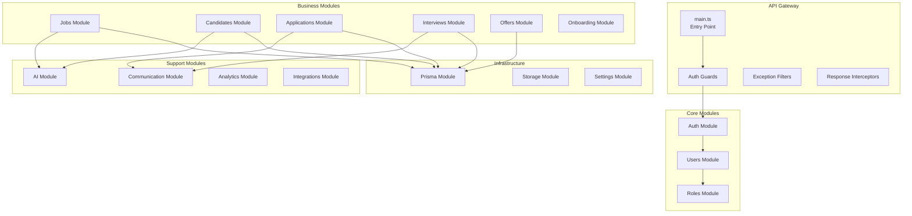

### Frontend Component Structure

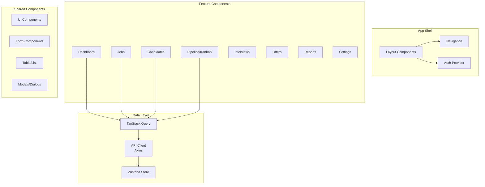

---

## Data Flow

### Request/Response Flow

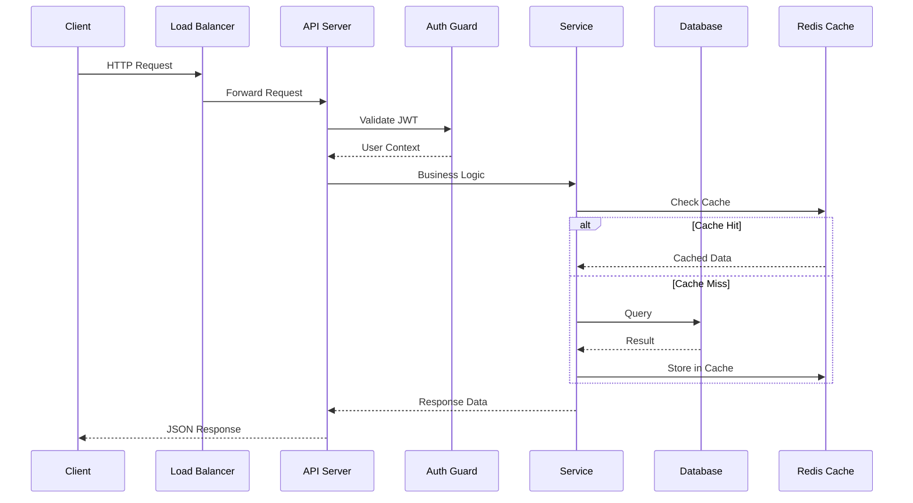

### Application Workflow

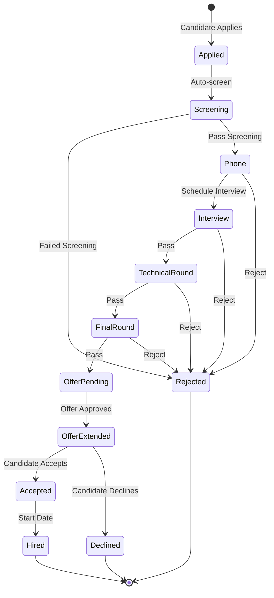

---

## Database Schema

### Core Entity Relationships

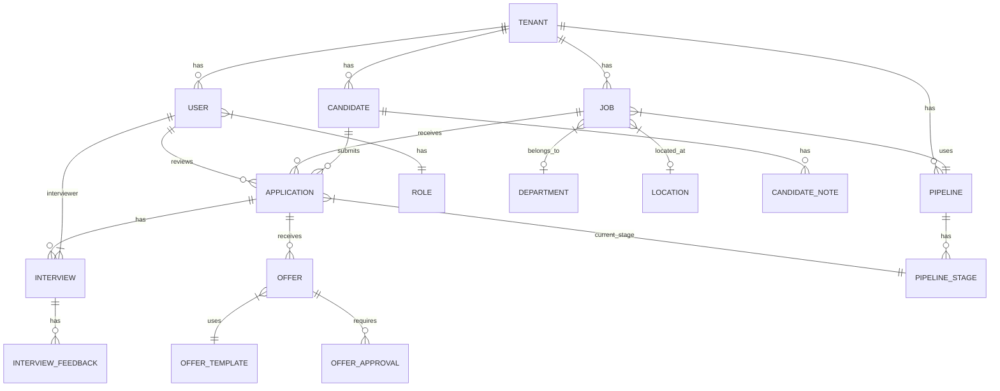

### Key Tables

| Table | Description |
|-------|-------------|
| `tenants` | Multi-tenant organizations |
| `users` | System users (recruiters, hiring managers) |
| `roles` | Custom role definitions |
| `jobs` | Job requisitions |
| `candidates` | Candidate profiles |
| `applications` | Job applications |
| `pipelines` | Hiring workflow templates |
| `pipeline_stages` | Stages within pipelines |
| `interviews` | Scheduled interviews |
| `interview_feedback` | Interviewer evaluations |
| `offers` | Job offers |
| `activity_logs` | Audit trail |

---

## Security Architecture

### Authentication Flow

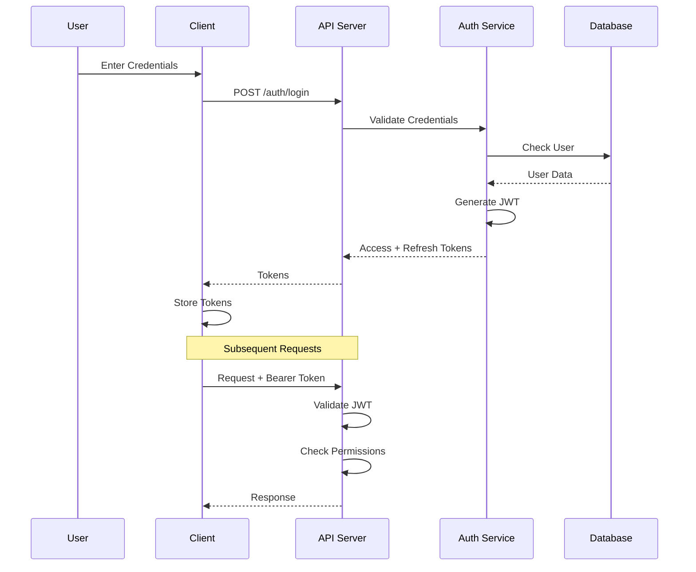

### Security Layers

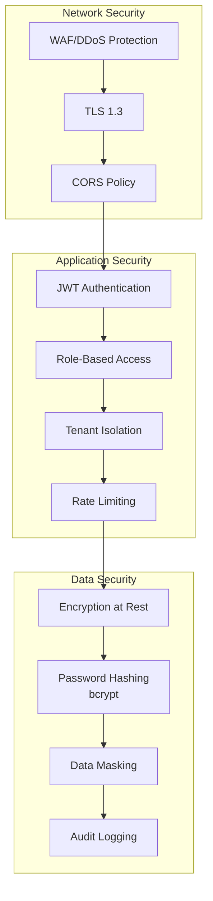

### Permission Model

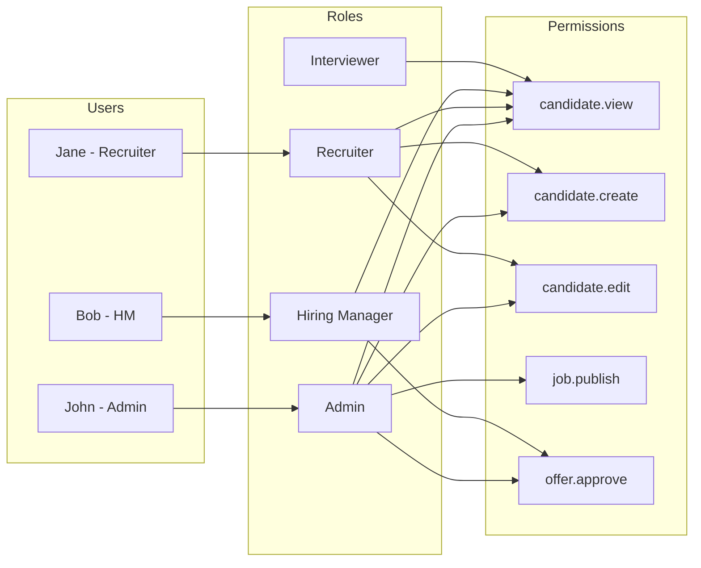

---

## Integration Architecture

### External Integrations

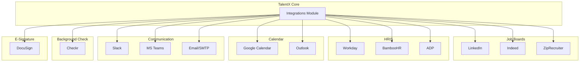

### Webhook Event Flow

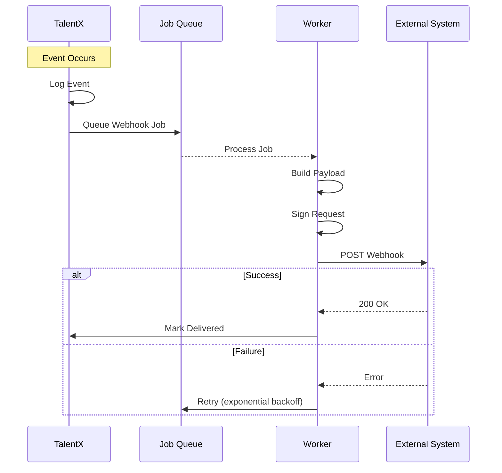

---

## Deployment Architecture

### Cloud Architecture (AWS)

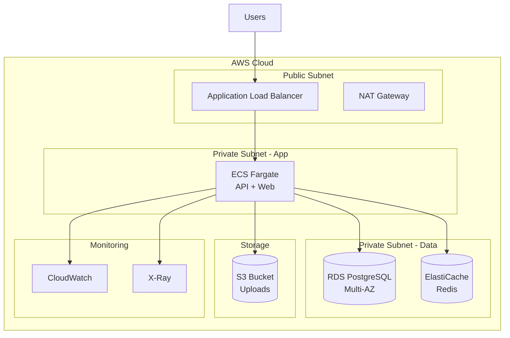

---

## Performance Considerations

### Caching Strategy

| Cache Layer | Use Case | TTL |
|-------------|----------|-----|
| **Browser** | Static assets | 1 year |
| **CDN** | Images, JS, CSS | 1 day |
| **Redis** | API responses | 5-60 min |
| **Database** | Query cache | Automatic |

### Query Optimization

- Indexed columns for frequent filters
- Pagination with cursor-based approach
- Selective field loading
- N+1 query prevention with includes

### Async Processing

- Resume parsing → Background job
- Email sending → Queue
- Report generation → Async with polling
- Webhook delivery → Queue with retry

---

## Scalability Roadmap

### Current (Monolith)
- Single API server
- Single database
- Redis for caching

### Phase 2 (Scale Out)
- Multiple API instances
- Database read replicas
- Redis cluster

### Phase 3 (Microservices)
- Separate services for:
  - Authentication
  - AI/ML processing
  - Notification delivery
  - Report generation
